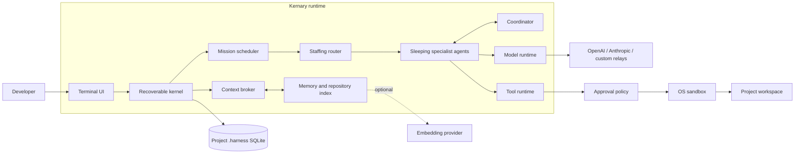

<p align="center">
  
</p>

<h1 align="center">Kernary Code</h1>

<p align="center">
  一个本地优先、可恢复、带证据链的多 Agent AI Coding Harness。<br>
  One kernel. Every model. Safe to ship.
</p>

<p align="center">
  <a href="https://github.com/zhaoxuya520/kernary-code/actions/workflows/ci.yml"></a>
  <a href="LICENSE-APACHE"></a>
  
</p>

> [!IMPORTANT]
> Kernary 正在公开开发中，`kernary-code` 尚未发布到 npm。当前请从源码构建；不要把仓库中的 npm 包目录当作已发布安装入口。

Kernary 不是给模型套一层聊天界面。它把会话、任务、Agent、工具调用、审批、上下文、记忆和恢复状态放进同一个本地 Kernel，让模型可以真正读取项目、修改文件、运行命令、调用专家 Agent，并留下可检查的证据。

## 为什么是 Kernary

| 设计目标 | Kernary 的做法 |
|---|---|
| 长任务可恢复 | Session、Mission、Tool Journal、Context 与 Agent 状态持久化到项目 `.harness/` |
| 多 Agent 不跑偏 | Staffing Router 按能力分配；Coordinator 处理依赖、冲突与交接；专家默认休眠 |
| 不把过程刷成日志墙 | Codex 风格 Transcript；当前阶段在输入框上方原位更新，完成后自动消失 |
| 文件修改可追踪 | 读写、进程退出、Patch、Undo 与审批都有结构化事件和证据 |
| 模型与中转站可替换 | OpenAI Responses、Chat Completions、Anthropic Messages 和自定义 Provider |
| 向量能力可选 | 未配置时走 lexical；配置后才启用项目级语义记忆、仓库重排和压缩锚点 |
| 权限不是一句提示词 | Approval Policy 与操作系统 Sandbox 分离，危险边界不会因模型同意而消失 |

## 快速开始

### 1. 从源码构建

需要 Git、Rust `1.98.0` 和平台原生构建工具。仓库的 CI 覆盖 Windows、Linux 与 macOS；当前 npm 平台包只准备了 Windows x64 和 Linux x64 glibc，尚未发布。

```bash
git clone https://github.com/zhaoxuya520/kernary-code.git
cd kernary-code
cargo build --release --locked -p harness-cli --bin kernary
```

Windows：

```powershell
.\target\release\kernary.exe --version
.\target\release\kernary.exe
```

Linux / macOS：

```bash
./target/release/kernary --version
./target/release/kernary
```

### 2. 连接模型

Kernary 不会在未配置模型时偷偷使用测试模型。第一次启动后，可以连接内置 Provider，也可以添加自己的中转站：

```text
/connect             # 选择内置 Provider 并安全输入 Key
/provider add        # 名称 → 协议 → URL → Key → 拉取模型 → 默认模型
/provider switch     # 切换 Provider
/provider key        # 验证成功后原子更换 Key，失败恢复旧 Key
/model               # 切换当前 Provider 的模型
```

自定义 Provider 支持三种协议：

| 协议 | 默认端点 | 认证方式 |
|---|---|---|
| OpenAI Responses | `/responses` | Bearer |
| OpenAI Chat Completions | `/chat/completions` | Bearer |
| Anthropic Messages | `/messages` | `x-api-key` + `anthropic-version` |

Provider、Key 引用和默认文本模型属于用户全局配置；Key 只进入操作系统 Credential Store。显式 `--model provider/model` 只覆盖当前启动。

### 3. 提交第一个任务

```text
请读取这个项目，找到测试失败的原因，修复后运行相关测试。
```

运行中，Kernary 会在输入框上方原位更新当前阶段，例如“连接模型”“分析上下文”“读取文件”“等待审批”；会话只保留用户消息、最终回答和有价值的工具证据。

## 它是怎样工作的



核心边界：

- **Kernel 决定状态**：模型输出不会直接成为“任务完成”；Mission 与 Evidence Gate 决定是否接受。
- **Agent 按需唤醒**：主 Agent 只拆任务，不读取所有专家说明；Staffing Router 根据结构化能力元数据选人。
- **Coordinator 不写代码**：它主持讨论、记录冲突、组织交接并生成必要的 Merge 工作项。
- **工具统一过门**：单 Agent 和子 Agent 都经过同一个 Tool Runtime、审批策略、沙箱和 Journal。
- **记忆按项目隔离**：向量 Provider 可以全局复用，但 Memory、Repository、Query Cache 和向量投影都留在当前项目。

## 常用任务

### 恢复和切换会话

每次直接运行 `kernary` 都创建新的项目本地 Session。历史只跟随当前文件夹，不会混入其他项目。

```text
kernary -c                 # 继续当前项目最近会话
kernary -r                 # 用方向键选择历史会话
kernary -r <id-or-title>   # 按短 ID 或标题恢复

/session                   # 会话选择页
/session new
/session rename <title>
```

首条消息先生成本地临时标题；首轮完整回答后，当前模型在后台生成短标题。手动重命名永远不会被后台结果覆盖。

### 选择权限与沙箱

权限模式决定“何时询问”，Sandbox 决定“系统实际允许什么”。二者不会互相绕过。

| 模式 | 行为 |
|---|---|
| `manual` | 所有 Tool 操作都确认 |
| `edit` | 项目文件编辑自动；终端与外部操作确认 |
| `auto` | 沙箱内低风险自动；高风险确认 |
| `full` | 沙箱内自动；Workspace Patch 仍确认 |
| `bypass` | 取消手动确认；必须显式确认，仍受 Sandbox hard deny |

```text
/permissions manual|edit|auto|full|bypass
/sandbox read-only|workspace-write|danger-full-access
```

`Shift+Tab` 在 `manual → edit → auto → full` 之间静默切换。Windows 使用受限 Token、ACL、私有 Desktop 与 Job Object；Linux 使用 bubblewrap namespace，缺少可信 `bwrap` 时 fail closed。

### 启动多 Agent 工作流

Kernary 内置 30 个版本化 Agent Profile，覆盖控制面、需求、架构、前端、后端、API、SQL、测试、安全、性能、发布、SRE、文档、本地化和产品分析。它们不是 30 份同名提示词：每个 Profile 都定义使命、非目标、输入、SOP、工具边界、证据合同、失败升级、记忆策略和模型预算。

```text
/agents tree                         # 查看控制面与 Worker 树
/agent <agent-id>                    # 查看角色合同和公开方法论
/team adaptive 2 <objective>         # 按任务选择专家并构建 Evidence DAG
```

包含“全栈”“完整产品”或“从零上线”的目标会构建专职交付 DAG；普通任务只唤醒真正需要的角色。

### 配置可选向量能力

```text
/vector setup
/vector providers
/vector provider <provider-id>
/vector model <model-id>
/vector status
```

内置 Voyage AI 与 Jina AI 模型目录；Custom 支持 OpenAI-compatible Embeddings。Kernary 会发送真实 Embedding 请求，验证响应为非空有限数值向量，并自动检测维度；聊天模型不能冒充向量模型。

| 未配置向量 | 配置并验证后 |
|---|---|
| Lexical memory / repository search | Hybrid retrieval 与语义重排 |
| 本地 extractive 压缩锚点 | 与 Goal/Task 相关的旧证据锚点 |
| 无 Embedding 请求和向量表 | 按 generation、namespace、内容哈希缓存 |

向量不可用不会阻止项目启动；系统会明确降级为 lexical-only。顶部状态栏常驻显示 `向量 未配置 / 待激活 / 已激活 / 异常`。

### 管理上下文和项目知识

```text
/context
/checkpoint <name>
/compact auto|safe|aggressive
/memory stats
/memory search lexical|hybrid <query>
/index status|build|update|search
```

压缩前先建立 durable checkpoint。Goal、当前 Task、Pin、Constraint、Decision、Error、完整 Tool 对和 in-flight continuation 原文保留；模型摘要必须引用真实 Context ID，否则回退到本地 extractive 路径。Transcript 不会因压缩而删除。

## Provider、缓存和推理摘要

- OpenAI Responses 使用稳定 `prompt_cache_key`；支持时启用显式缓存选项。
- Anthropic Messages 缓存稳定 system/tool 前缀，并保留增长中的对话缓存。
- Agent Profile、项目规则和确定性 Tool ABI 位于稳定前缀；任务 ID、检索结果和用户输入位于动态尾部。
- 底部常驻显示 Provider 报告的 Prompt Cache 命中率；`/cache` 区分 Provider Cache 与本地 L1/L2。
- Kernary 只显示公开 reasoning summary 或可审计阶段摘要，不展示、推测或伪造模型私有思维链。

## 配置与本地数据

| 数据 | Windows | Linux / macOS | 范围 |
|---|---|---|---|
| 文本 Provider、默认模型 | `%APPDATA%\Kernary\` | `$XDG_CONFIG_HOME/kernary/` 或 `~/.config/kernary/` | 用户全局 |
| Embedding Provider 目录 | 同上 `vector.toml` | 同上 `vector.toml` | 用户全局 |
| Key | OS Credential Store | OS Credential Store | 用户全局，不写项目 |
| Session、Context、Agent、Memory、Vector | `<project>/.harness/` | `<project>/.harness/` | 当前项目 |
| 项目指令 | `<project>/.harness/agent.md` | `<project>/.harness/agent.md` | 覆盖全局 `~/.kernary/agent.md` |

界面语言：

```text
/language en
/language zh-CN
/language zh-TW
/language ja
```

## 自动化和扩展

严格非交互模式适合 CI：

```bash
kernary --model openai/gpt-5.6-sol exec --json "运行测试并总结结果"
```

扩展能力包括 MCP stdio / HTTP / SSE / OAuth、Plugin、Skill、Browser Runtime、LSP 3.18、Git intelligence、Patch Preview 和安全 Undo。Browser、LSP 与 MCP 默认保持惰性，只有命令或 Agent 明确需要时才启动。

## 开发与验证

```bash
cargo fmt --all -- --check
cargo clippy --workspace --all-targets --locked -- -D warnings
cargo test --workspace --locked --no-fail-fast
npm test
npm run fixtures:check
```

CI 还会构建 Windows x64、Linux x64 和 macOS arm64 便携产物，验证 `kernary` / `harness` 兼容命令、`doctor --json`、归档校验和及启动性能预算。

## 当前限制

- npm 包结构已经准备完成，但 `kernary-code` 尚未发布。
- OpenAI-compatible Chat 路由只有在 Provider 明确支持时才有公开推理摘要；否则显示 Kernary 的阶段摘要。
- Windows 的默认网络限制不是 WFP 防火墙级隔离，`/sandbox` 会如实显示实际后端强度。
- 同一项目目录默认只允许一个 Kernary 进程持有状态锁；其他项目目录可以并行运行。

## 安全

凭证不进入项目文件或日志。发现安全问题请不要公开 Issue，按 [SECURITY.md](SECURITY.md) 私下报告。

## License

Apache-2.0。参见 [LICENSE-APACHE](LICENSE-APACHE) 与 [NOTICE](NOTICE)。
